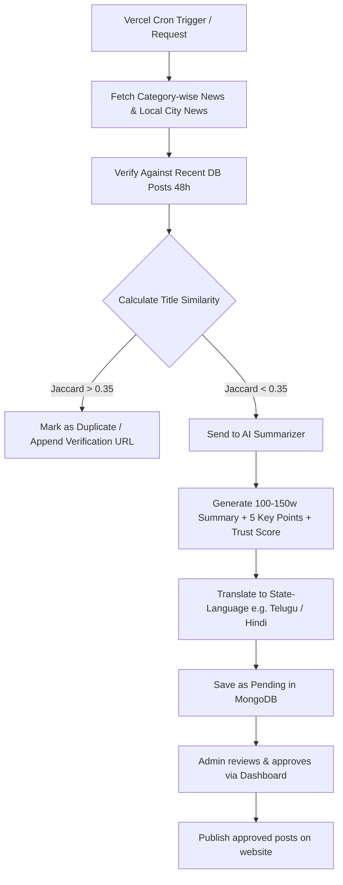

# AI-Powered Automated News Aggregator

A legally safe, automated regional and category-based news aggregation platform built with Next.js, Tailwind CSS, MongoDB, and OpenAI.

---

## ⚖️ Legal Safety & Editorial Rules

To ensure complete copyright compliance and avoid copyright infringement issues, this application operates under strict guidelines:
1. **No Plagiarism**: We do NOT copy-paste articles, nor do we rewrite paragraphs line-by-line.
2. **Original Summaries**: The AI generates a completely original, 100-150 word summaries and exactly 5 factual bullet points from metadata (title and description snippet).
3. **No Hallucinations**: The AI is instructed to never invent quotes, figures, death tolls, scores, dates, or names. If information is missing, it outputs *"Details not confirmed yet"*.
4. **Attribution**: We display the original source name and a direct "Read full article" link to the original publisher for every item.
5. **Deduplication**: Word-based Jaccard similarity is run on all feeds. Overlapping articles are combined into verification metrics rather than duplicated.

---

## 📁 Project Folder Structure

```text
├── app/
│   ├── api/
│   │   ├── admin/
│   │   │   ├── login/route.js        # Admin login and logout (HTTP-only cookies)
│   │   │   ├── logs/route.js         # Fetch logs & duplicate check logs retrieval
│   │   │   ├── posts/route.js        # Admin post query endpoint
│   │   │   └── posts/[id]/route.js   # Admin PUT (edit/approve/reject) & DELETE
│   │   ├── cron/
│   │   │   └── fetch-news/route.js   # 24h Daily automation scraper
│   │   ├── posts/
│   │   │   ├── route.js              # approved posts list (category/location filters)
│   │   │   └── [slug]/route.js       # single post retrieval with translation mapper
│   │   └── preferences/route.js      # user localization & preference syncing
│   ├── admin/
│   │   ├── approved/page.js          # Admin approved posts view shortcut
│   │   ├── pending/page.js           # Admin pending approval list view
│   │   └── page.js                   # Admin login page and main dashboard UI
│   ├── category/
│   │   └── [category]/page.js        # Categorized news feeds
│   ├── lang/
│   │   └── [lang]/page.js            # Language-specific news editions (e.g. /lang/te)
│   ├── local/
│   │   └── page.js                   # Geolocation location-based regional news
│   ├── posts/
│   │   └── [slug]/page.js            # News post detail view with translation toggles
│   ├── search/
│   │   └── page.js                   # Search index results feed
│   ├── settings/
│   │   └── page.js                   # Manual location and language preferences settings
│   ├── globals.css                   # Global Tailwind CSS and utility declarations
│   ├── layout.js                     # HTML root skeleton with navigation and state provider
│   └── page.js                       # Interactive Homepage with hero and regional grids
├── components/
│   ├── AppContext.js                 # Shared client preference context & Nominatim geolocator
│   ├── Footer.js                     # Layout footer with legal fair use notices
│   ├── Navbar.js                     # Header with sticky category list, search & settings modal
│   └── PostCard.js                   # Reusable article render card with trust indicators
├── lib/
│   ├── adminAuth.js                  # JWT token signs, session validates and bcrypt hashes
│   ├── dbConnect.js                  # Cached mongoose connection management
│   ├── duplicateDetector.js          # Jaccard similarity-based deduplication logic
│   ├── locationHelper.js             # State-to-regional language mapping (e.g. AP -> Telugu)
│   └── openAiSummarizer.js           # OpenAI gpt-4o-mini integration & mock fallback builder
├── models/
│   ├── AdminUser.js                  # Admin user credentials schema
│   ├── Category.js                   # News category list schema
│   ├── DuplicateCheckLog.js          # Deduplication auditing logs schema
│   ├── FetchLog.js                   # Scraper runs and validation logs schema
│   ├── LocationLog.js                # Anonymous geo-mapping stats schema
│   ├── NewsPost.js                   # Core news article, summary & translation store schema
│   ├── Source.js                     # Trusted feed origins schema
│   └── UserPreference.js             # Client preferences storage schema
├── scripts/
│   └── seed.js                       # Database seeder (samples, categories, default admin)
├── .env.example                      # Configuration template
├── vercel.json                       # Vercel Cron registration config
├── package.json                      # Node dependencies & npm scripts
└── README.md                         # Product architecture manual
```

---

## 🗄️ Database Models (MongoDB)

All schemas are declared using Mongoose:
- **`NewsPost`**: Main storage. Includes metadata, category, original URLs, AI summary, key points, location fields (city, state, country), trust scores, verification source links, duplicate flags, and translated summaries map.
- **`Source`**: Defines trusted publisher urls and validation statuses.
- **`Category`**: Holds system category slugs (Technology, Sports, Education, Men, Women, Children, Accidents, Local, National, International, Business, Health, Jobs, Entertainment, Politics, Science).
- **`AdminUser`**: Stores encrypted administrator login details.
- **`FetchLog`**: Logs scraper details (fetched counts, summarized counts, status, errors).
- **`DuplicateCheckLog`**: Counts duplicate reports and overlaps compared.
- **`UserPreference`**: Stores manually configured or automatically detected user locations and preferred languages.
- **`LocationLog`**: Keeps anonymous metadata of requested regional detections.

---

## 🤖 Aggregation & Automation Flow



1. **Daily Scheduler**: Fires a request to `/api/cron/fetch-news` once every 24 hours.
2. **Scraper**: Fetches top articles per category via Google News RSS search (falls back to GNews/NewsAPI if keys are set).
3. **Deduplication**: Runs Jaccard Similarity on word sets of titles. If an incoming post matches a recent DB post, its URL is appended to the original's `verificationSources` and it is auto-rejected as a duplicate to prevent clutter.
4. **AI Generation**: Unique stories are sent to OpenAI (or processed via our local Mock template fallback if no API key is set). The model creates a fact-only, original summary and 5 bullet points.
5. **Regional Translation**: The summary is translated to regional languages (like Telugu for Andhra Pradesh, Hindi for North India) and saved in the database.
6. **Safety Gate**: Low confidence scores (< 60) are rejected automatically. Safe items are saved as `pending`.
7. **Editorial Release**: Admin logs in, reviews the pending queue, edits details if necessary, and clicks **Approve** to publish.

---

## 🛠️ Local Setup & Installation

### 1. Prerequisites
- **Node.js**: Version 18.x or above.
- **MongoDB**: A running local instance or MongoDB Atlas cluster connection.

### 2. Installation Steps
Clone or open the project folder, then install the dependencies:
```bash
npm install
```

### 3. Environment Setup
Create a `.env` file in the root directory (based on `.env.example`):
```env
MONGODB_URI=mongodb://localhost:27017/news-aggregator
OPENAI_API_KEY=your_openai_api_key_here
JWT_SECRET=supersecretjwtkey12345!
ADMIN_USERNAME=admin
ADMIN_PASSWORD=admin123
```
*Note: If no `OPENAI_API_KEY` is provided, the platform automatically activates its high-quality mock generator, making the scraper, translations, and dashboard testable without paying.*

### 4. Database Seeding
Populate the database with initial categories, trusted sources, default admin user, and sample stories (including a Vizag beach sensor local news story):
```bash
npm run seed
```

### 5. Running the Application
Start the Next.js development server:
```bash
npm run dev
```
Open [http://localhost:3000](http://localhost:3000) in your web browser.

---

## 🖥️ Admin Operations

- Access the Admin Dashboard at [http://localhost:3000/admin](http://localhost:3000/admin).
- Log in with credentials:
  - **Username**: `admin`
  - **Password**: `admin123`
- Use the **Trigger Aggregator Scraper** button to immediately run news aggregation manually.
- Review pending news posts, edit details in the modal, and approve them to make them live instantly.

---

## 🚀 Deployment (Vercel)

1. Create a new project on [Vercel](https://vercel.com) and link your repository.
2. In Vercel Project Settings, add the Environment Variables:
   - `MONGODB_URI` (Use a MongoDB Atlas cluster URI)
   - `OPENAI_API_KEY`
   - `JWT_SECRET`
   - `ADMIN_USERNAME`
   - `ADMIN_PASSWORD`
3. Vercel will automatically read the `vercel.json` file and register the daily cron job.
4. Set the `CRON_SECRET` variable in Vercel to secure the cron route.
